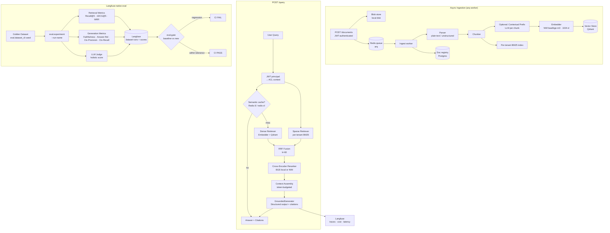

# Production RAG — Async Ingestion · Hybrid Retrieval · Semantic Cache · Eval-Gated CI

A production-grade Retrieval-Augmented Generation service built behind clean,
swappable interfaces (no framework lock-in in the core). It pairs a real
retrieval pipeline — async document ingestion, hybrid search, reranking,
multi-tenant isolation — with the thing most demos skip: a rigorous
**Langfuse-native eval harness** that produces numbers, bootstrap confidence
intervals, and a **CI gate** that blocks quality regressions.

## Overview

Most RAG demos glue an LLM to a vector database and stop there. This system
adds the engineering discipline required before production:

- **Async document ingestion API** — authenticated tenants `POST /documents`;
  the request returns `202` immediately and an `arq`/Redis worker parses,
  chunks, embeds, and indexes in the background. Incremental re-ingest and
  async delete are content-hash aware.
- **Hybrid retrieval** (dense + BM25 + RRF) with cross-encoder reranking.
- **Contextual chunking**: an optional LLM-generated prefix per chunk improves
  recall (following Anthropic's contextual-retrieval technique).
- **Server-side ACL isolation**: every chunk carries a `tenant_id`; the filter
  is applied **before** similarity and is derived from a cryptographically
  verified JWT, never from the prompt text.
- **Grounded, cited generation**: structured output enforces inline citations;
  the generator refuses when context is insufficient.
- **Guardrails**: prompt-injection heuristics + indirect-injection scanning on
  input; PII redaction at ingest (fail-closed); output-groundedness and
  citation enforcement on the way out.
- **Two-tier semantic cache** (Redis 8 / redis-vl): answer-level and
  retrieval-level, tenant/collection-isolated, with targeted eviction on
  document change and a TTL backstop. Opt-in, off by default.
- **RAGAS-style metrics implemented natively** — no `ragas` dependency in the
  spine, fully injectable for offline testing.
- **Langfuse-native eval**: experiments register as dataset runs, per-item
  scores push back to Langfuse, and a paired-bootstrap / threshold **gate**
  reads those scores back to fail CI on regression.

---

## Architecture

### Mermaid diagram (renders on GitHub)



### ASCII diagram (quick reference)

```
POST /documents (202) → blob store + arq queue
        └─ worker: parse → chunk (+contextual prefix) → embed → Qdrant (+per-tenant BM25)

POST /query → JWT → ACL context → semantic cache?
      ├─ hit  → cached Answer
      └─ miss → hybrid retrieve (dense + BM25) → RRF fuse → rerank (cross-encoder)
                → ACL filter (pre-similarity, server-side) → context assembly (budgeted)
                → generate (grounded, cited, structured output) → Answer + citations
                                                 │
         traces + cost + latency metrics → Langfuse dashboard
                                                 │
eval: golden dataset → experiment → Langfuse scores → gate (baseline vs new) → CI pass/fail
```

---

## Repo Layout

```
.
├── core/                 # Contracts, types, config, registry, pipeline
│   ├── interfaces.py     # Protocol definitions (Embedder, VectorStore, SparseRetriever, …)
│   ├── types.py          # Shared data models (Chunk, Answer, ACLContext, …)
│   ├── config.py         # All env knobs via pydantic-settings (Settings) — source of truth
│   ├── registry.py       # Single place that names concrete implementations
│   ├── pipeline.py       # RAGPipeline: cache-aware answer(), hybrid retrieve + rerank
│   ├── rrf.py            # Reciprocal Rank Fusion
│   └── context_assembly.py
│
├── providers/            # Swappable implementations behind the Protocols
│   ├── auth/             # jwt_verifier, dev_signer, allowlist
│   ├── embedders/        # openai_compatible (NIM / real OpenAI)
│   ├── generators/       # openai_compatible.py, anthropic.py
│   ├── rerankers/        # local_cross_encoder (BGE), nim_rerank
│   ├── sparse/           # bm25, per-tenant store, pickle loader
│   ├── vectorstores/     # qdrant_store.py
│   ├── docstore/         # postgres, memory (document registry)
│   ├── manifest/         # jsonl_store (chunk manifest per document)
│   ├── blobstore/        # local_disk (uploaded file bytes)
│   └── pii/              # regex_detector, presidio_detector (optional)
│
├── ingest/               # Ingestion pipeline
│   ├── worker.py         # arq worker: ingest_document / delete_document tasks
│   ├── incremental.py    # Content-hash-aware (re)ingest + delete
│   ├── run.py            # CLI: python -m ingest.run --dataset X [--limit N]
│   ├── parsers/          # plain_text, unstructured
│   ├── chunking.py       # Fixed-size + overlap chunker
│   ├── contextual.py     # LLM-generated contextual prefix (cached)
│   ├── pii.py            # PII redaction at ingest time (fail-closed)
│   └── audit.py          # Redaction audit trail
│
├── retrieval/
│   └── hybrid.py         # DenseRetriever, HybridRetriever
│
├── generation/
│   ├── grounded_generator.py   # Token-budgeted assembly + citation enforcement
│   └── prompts.py
│
├── guardrails/
│   ├── runner.py                 # Orchestrates the guardrail stages
│   ├── input_injection.py        # Heuristic + optional LLM injection/jailbreak detection
│   ├── pii_guard.py              # Output PII guard
│   ├── output_groundedness.py    # Answer-vs-context groundedness
│   ├── citation_enforcement.py   # Reconciles [n] markers against context
│   └── schema_validation.py
│
├── cache/                # Semantic cache (opt-in)
│   ├── semantic_cache.py         # Protocol + serialization + build_cache + FakeSemanticCache
│   └── _redisvl_backend.py       # Only redisvl importer (lazy)
│
├── eval/                 # Langfuse-native evaluation harness
│   ├── dataset_cli.py    # CLI: seed a dataset / add-from-trace
│   ├── experiment.py     # CLI: run experiment → Langfuse dataset run
│   ├── gate.py           # CLI: gate a run vs a baseline run (paired-bootstrap / thresholds)
│   ├── evaluators.py     # Per-item metric wiring
│   ├── langfuse_eval.py / _langfuse_backend.py  # Langfuse SDK seam (lazy-imported)
│   ├── generation_metrics.py     # Native RAGAS-style: faithfulness, answer_relevancy, …
│   ├── retrieval_metrics.py      # recall_at_k, ndcg_at_k, mrr, precision_at_k
│   ├── llm_judge.py      # Holistic LLM judge
│   ├── stats.py          # bootstrap_ci, paired_bootstrap
│   ├── ragas_adapter.py  # Optional cross-check against the ragas library
│   └── fast_subset.py    # 15-item subset for CI --fast runs
│
├── corpora/              # Dataset adapters (hotpotqa / arxiv / financebench)
├── observability/        # langfuse_tracing (v4 OTel), cost, dashboard
├── app/
│   ├── api.py            # FastAPI: /query + /healthz (make api)
│   ├── documents.py      # /documents router (async upload / list / get / delete)
│   ├── auth.py           # require_principal — JWT → tenant identity
│   ├── ui.py             # /ui test console + dev-token endpoint (make console)
│   └── static/
│       └── console.html  # single-page console: upload → ingest → query
│
├── tests/                # Offline test suite (fakes, no secrets, no services)
├── infra/
│   ├── docker-compose.yml  # Qdrant + Postgres 17 + Redis 8 + Langfuse v3 stack
│   ├── postgres-init/      # creates the `rag` and `langfuse` databases on first boot
│   └── .env.example
├── .github/workflows/
│   └── eval-gate.yml     # CI: lint + offline tests + ACL-isolation + eval gate
├── Makefile
└── pyproject.toml
```

---

## Stack

| Concern | Default | Swappable to | Switch |
|---|---|---|---|
| Generation | NVIDIA NIM · `meta/llama-3.3-70b-instruct` | Anthropic Claude (Sonnet) | `GEN_PROVIDER=anthropic` |
| Embeddings | NIM · `baai/bge-m3` (1024-d) | OpenAI · `text-embedding-3-large` (3072-d) | `EMBED_BASE_URL` + `EMBED_MODEL` + `EMBED_DIMENSION` |
| Vector store | Qdrant | (add a `VectorStore` impl + registry branch) | `VECTOR_STORE` |
| Reranker | BGE cross-encoder (local, `bge-reranker-v2-m3`) | NIM rerank (`nv-rerankqa-1b-v2`) | `RERANKER=nim` |
| Document registry | Postgres | in-memory (tests) | provider wiring |
| Semantic cache | off | Redis 8 / redis-vl | `CACHE_ENABLED=true` (`--extra cache`) |
| Observability | off | Langfuse (self-host or Cloud) | `LANGFUSE_ENABLED=true` |

All switches are env vars read by `core/config.py` (pydantic-settings).
`core/registry.py` is the only module where concrete class names appear —
nothing outside `core/config.py` reads env directly. No code changes are
needed to flip providers.

> **Note:** the vector store is Qdrant-only in the shipped code (`pgvector`
> was removed). The `VectorStore` Protocol keeps adding another backend to a
> single new file plus one registry branch.

---

## The API

The service is **product-driven**: tenants push their own documents in and query
them, rather than a fixed corpus being pre-ingested. Every route derives its
tenant identity from a verified JWT (`app/auth.py`), never from the request body.

| Method | Route | Behaviour |
|---|---|---|
| `POST` | `/documents` | Upload a file. Returns **`202 Accepted`** and enqueues async ingest (parse → chunk → embed → index) on the `arq`/Redis worker. |
| `GET` | `/documents` | List the caller's documents and their ingest status. |
| `GET` | `/documents/{id}` | Fetch one document's metadata / status. |
| `DELETE` | `/documents/{id}` | Returns **`202`** and enqueues async delete (drops chunks from Qdrant + BM25 + registry). |
| `POST` | `/query` | Grounded, cited RAG answer over the caller's own documents. |
| `GET` | `/healthz` | Liveness probe. |

Ingest, re-ingest, and delete are content-hash aware (`ingest/incremental.py`),
so re-uploading an unchanged document is a no-op and edits re-index only what
changed.

---

## Datasets

Three corpora are supported for **evaluation**, each with a corpus adapter in
`corpora/` and a golden eval set written by `ingest.run` to
`data/eval/<dataset>.json`:

| Dataset | Domain | Why | Tenant split |
|---|---|---|---|
| HotpotQA | Multi-hop QA | Gold supporting sentences → retrieval metrics out of the box | ~5 % tenant-A-only, ~5 % tenant-B-only |
| arXiv | Scientific papers | Long documents, synthesized golden answers | Same split |
| FinanceBench | Financial filings | Precise factual QA, citation sensitivity | Same split |

The tenant split exercises the ACL isolation guarantee: tenant-A queries must
never surface tenant-B chunks. This is enforced end-to-end in the
`acl-isolation` CI job against live Qdrant + Postgres.

---

## Quickstart

```bash
# 1. Install (shared uv venv, all extras)
make install                        # uv sync --all-extras

# 2. Configure
cp infra/.env.example .env
# Edit .env — at minimum set NVIDIA_API_KEY=nvapi-...

# 3. Start backends
make up                             # Qdrant + Postgres + Redis + Langfuse stack
# or just the app backends:
make up-app                         # Qdrant + Postgres

# One postgres:17 server holds two databases with separate owners:
#   rag       -> the document registry   (PG_DSN)
#   langfuse  -> the Langfuse stack      (DATABASE_URL, set in compose)
# They are created on first boot by infra/postgres-init/.

# 4a. Product path — run the API and push documents
make api                            # FastAPI on :8000 (uvicorn --reload)
arq ingest.worker.WorkerSettings    # (separate shell) start the ingest worker
#   POST /documents to upload, POST /query to ask

# 4b. Eval path — ingest a benchmark corpus and score it
make ingest DATASET=hotpotqa
make seed   DATASET=hotpotqa ITEMS=data/eval/hotpotqa.json   # golden items → Langfuse
make eval   DATASET=hotpotqa RUN=baseline                    # experiment → Langfuse run
make eval   DATASET=hotpotqa RUN=candidate
make gate   DATASET=hotpotqa RUN=candidate                   # vs "baseline"; exits nonzero on regression

# 5. Test console — upload a document, watch it ingest, query it
make console                        # API + console on http://127.0.0.1:8000/ui
```

The console drives the real HTTP API: it mints a JWT for a tenant you pick, uploads
through `POST /documents`, polls status until the worker reports `ready`, then queries
via `POST /query`. Because every action is an ordinary authenticated request, it
exercises auth, tenant scoping, async ingest, and retrieval rather than an in-process
shortcut. It needs the full stack up (`docker compose -f infra/docker-compose.yml up -d`)
for upload to work end-to-end; `/query` alone only needs Qdrant.

> **Security:** `/ui` and `/ui/token` mint dev credentials, so both return **404**
> unless `AUTH_DEV_SIGNER_ENABLED=true` *and* `JWT_SECRET` are set. `core/config.py`
> refuses to boot with that flag when `APP_ENV=prod`, so a production deploy exposes
> neither route.

> **Note on contextual prefixing:** pass `--contextual` to `ingest.run` to
> enable per-chunk LLM context prefixes. This fires ~1 LLM call per chunk, so
> respect NIM's ~40 rpm free-tier cap by using `--limit`.

---

## Semantic Cache

An opt-in, two-tier semantic cache (`cache/`) short-circuits repeated work:

- **Answer tier** — a near-duplicate query (cosine ≥ `CACHE_SIMILARITY_THRESHOLD`,
  default `0.9`) returns the cached `Answer` without touching the pipeline.
- **Retrieval tier** — caches the fused/reranked context so generation still runs
  on fresh phrasing while retrieval is reused.

Entries are **tenant- and collection-isolated**, evicted precisely when a
document they depend on changes or is deleted, and expire under a per-entry TTL
(`CACHE_TTL_SECONDS`, default `3600`) as a staleness backstop. The cache is
**bypassed on the eval path** so it can never inflate metrics. Backed by Redis 8
via `redis-vl` (query engine in core); the redis-vl import is fully lazy, so the
offline test suite and lint run without it.

Enable with `uv sync --extra cache` and `CACHE_ENABLED=true` against a real
Redis 8 (the official `redis:8` image — Homebrew's `redis@8` omits the query
engine).

---

## Guardrails & Security

**JWT-derived tenant identity** (`app/auth.py`)
Every request's tenant/ACL context comes only from a cryptographically verified
JWT. `QueryRequest` carries no identity field; a missing/invalid token is a 401.
The tenant is never taken from prompt text or request body.

**Server-side ACL pre-similarity filter**
Every chunk carries `tenant_id` and optional `acl_tags`. The vector store and
BM25 retriever apply ACL as a filter condition **before** scoring, not as a
post-hoc exclusion.

**Prompt-injection / jailbreak detection** (`guardrails/input_injection.py`)
`InjectionGuardrail` scans user input against heuristic patterns
(ignore-previous-instructions, DAN mode, role-override, etc.), with an optional
LLM second-opinion path for ambiguous inputs. A match blocks the request before
it reaches the pipeline.

**Indirect-injection scanning**
Retrieved chunk text is treated as **untrusted data**. A scan over retrieved
content flags `indirect_injection_suspected`, and the generation prompt separates
system instructions from retrieved passages using numbered `[n]` markers, so
payloads embedded in documents are less likely to be read as instructions.

**PII redaction at ingest (fail-closed)** (`ingest/pii.py`)
Document text is redacted before chunking (`pii_mode` defaults to `redact`); a
detector error **fails closed** rather than passing raw text through. Regex
detectors ship by default; Presidio NER is an optional extra. Each redaction is
logged to an audit trail.

**Output guardrails**
An output-guardrail BLOCK overwrites the answer with a generic refusal and
scrubs every metadata copy — the block reason stays only in the trace.
Groundedness and citation-enforcement stages reconcile inline `[n]` markers
against the actual context window; if context is insufficient the generator sets
`refused=True`.

---

## Eval Methodology

Evaluation is **Langfuse-native**: an experiment run registers as a Langfuse
dataset run, per-item metrics are pushed as scores linked to their traces, and
the gate reads those scores back to decide pass/fail.

**Retrieval metrics** (`eval/retrieval_metrics.py`)
Recall@k, Precision@k, MRR, nDCG@k against gold `relevant_doc_ids` exported by
the corpus adapter. Default k=5 (because `rerank_top_n=8`).

**Generation metrics** (`eval/generation_metrics.py`)
Native implementations of the four RAGAS metrics — no external `ragas` dependency
in the spine (an optional `ragas_adapter.py` cross-check exists):
- **Faithfulness**: fraction of atomic answer claims supported by contexts.
- **Answer Relevancy**: mean cosine similarity between reverse-generated questions and the original.
- **Context Precision**: AP-style weighted precision over context ranks.
- **Context Recall**: fraction of ground-truth statements attributable to contexts.

**LLM judge** (`eval/llm_judge.py`)
A holistic quality score across faithfulness, completeness, and coherence.

**Bootstrap confidence intervals** (`eval/stats.py`)
`bootstrap_ci` reports 95 % CIs on all metrics; `paired_bootstrap` backs the
delta distribution the gate uses.

**CI gate** (`eval/gate.py` + `.github/workflows/eval-gate.yml`)
`eval.gate` reads per-item scores for the new run and a named `baseline` run back
from Langfuse and applies the configured gate (paired-bootstrap and/or absolute
thresholds), exiting nonzero on a regression. `nan` CI-bounds/thresholds are
treated as non-passing so an empty result can't vacuously pass.

> **Status:** the eval plumbing is complete; a live `baseline` Langfuse dataset
> run (plus `LANGFUSE_*` repo secrets) is the remaining step before the CI gate
> has something to compare against. Local measured numbers (N=50, bge-m3):
> HotpotQA baseline recall@5 ≈ 0.93, MRR ≈ 0.98, nDCG@5 ≈ 0.90.

---

## Observability

Langfuse tracing is opt-in (`LANGFUSE_ENABLED=true`, Langfuse v4 / OpenTelemetry).
When enabled, `observability/langfuse_tracing.py` emits a trace per query
containing:

- Retrieval scores and chunk IDs for each stage (dense, BM25, fused, reranked).
- LLM token counts and estimated cost (`observability/cost.py`).
- End-to-end latency broken down by component.

Queries are redacted **before** the root span is created, and a blocked query
traces as `[BLOCKED]`. The self-hosted Langfuse stack starts with `make up`
(web on port 3000).

---

## What I'd Do at 100× Scale

To scale the RAG pipeline to 100× data volume and traffic, we leverage five operational lessons from Notion's search infrastructure engineering. Because the system is structured around decorator/factory registries and `typing.Protocol` interfaces, scaling is accomplished by writing new backends (providers) and swapping them via environment variables, avoiding edits to the query pipeline (`core/pipeline.py`).

| Operation | Current Limitation | 100× Scaling Architecture | Interface & Seam |
|---|---|---|---|
| **Multi-Tenancy Isolation** | Logical boundaries; all tenant vectors share one collection separated by query filters. | **Physical namespace/collection-per-tenant isolation**. Prevents cross-tenant vector scanning, containerizes data, and contains leak blast-radius. | `VectorStore` Protocol (`core/interfaces.py`). Switched configuration: `tenant_isolation` (`pooled` vs `physical`). |
| **Vector Store Hosting** | Always-on, pay-per-uptime VM instances. | **Serverless Vector DB** backing storage to object storage (e.g. Turbopuffer). Yields ~60% cost reduction by billing for active use instead of idle compute. | `VectorStore` Protocol (`core/interfaces.py`). Registry branch: `providers/vectorstores/turbopuffer_store.py`. |
| **Ingestion Pipeline** | Single async `arq` worker; no streaming or Spark/Ray fan-out. | **Decoupled execution lanes**: Parallel Spark/Ray batch backfills + Kafka CDC streaming lane for low-latency ingest, yielding sub-minute data freshness. | `SparseRetriever` / `VectorStore` write APIs (`ingest/worker.py`). |
| **Embedding Generation** | Paid, rate-limited public APIs; high token costs and latency overhead. | **Self-hosted embedding models** (e.g. Triton Inference Server / vLLM on local GPU instances). Yields ~90% cost reduction and removes call limits. | `Embedder` Protocol (`core/interfaces.py`). Registry branch: `providers/embedders/selfhosted.py`. |
| **Capacity Scaling** | In-place collection re-sharding and online schema/collection migrations. | **Generation-based routing** (monotonic routing by `corpus_version` / `generation`). Point raw writes to a new collection/version index and retire old indices when depleted, avoiding online re-shards. | `VectorStore` / `RAGPipeline` boundaries (`ensure_collection(dimension, version)`). |

Other operational dimensions scale similarly:
- **BM25 retrieval** migrates from in-process per-tenant indexes to a distributed Elasticsearch/OpenSearch cluster using BM25F with tenant-routing.
- **Reranking** runs batched GPU inference via NVIDIA NIM containers to maximize throughput.
- **Semantic cache** promotes the single Redis 8 node to a Redis Cluster with per-tenant keyspaces, already the shape the cache uses today.
- **Rate limiting** moves from the per-instance question cap to a distributed Redis token-bucket middleware at the API boundary.
- **Evaluation** scales from quick CI gates to scheduled nightly evaluations of the full corpus via runner hooks.

---

## Make Targets

| Target | Description |
|---|---|
| `make install` | `uv sync --all-extras` — create venv and install everything |
| `make up` | Start Qdrant + Postgres + Redis + the full Langfuse v3 stack |
| `make up-app` | Start app backends only (Qdrant + Postgres) |
| `make up-langfuse` | Start the Langfuse v3 stack (web + worker + postgres + clickhouse + redis + minio) |
| `make down` | Stop all backend services |
| `make ingest DATASET=X` | Ingest corpus X (hotpotqa / arxiv / financebench) |
| `make seed DATASET=X ITEMS=…` | Upload golden items to a Langfuse dataset |
| `make eval DATASET=X RUN=R` | Run an eval experiment → Langfuse dataset run |
| `make gate DATASET=X RUN=R` | Gate run R against the `baseline` run; exits nonzero on regression |
| `make console` | Launch the API + test console on http://127.0.0.1:8000/ui |
| `make api` | Launch the FastAPI service on port 8000 (uvicorn --reload) |
| `make test` | Run the test suite (`pytest`) |
| `make lint` | Lint with ruff |
| `make fmt` | Format with ruff |
| `make clean` | Remove `.pytest_cache`, `.ruff_cache` |

For `ingest` with a size limit or contextual prefixing, call the module
directly:

```bash
uv run python -m ingest.run --dataset hotpotqa --limit 200 --contextual
```

---

## Status

The core safety/correctness work is landed: JWT auth, output-block containment,
fail-closed ingest PII redaction, pre-trace query redaction, and true per-tenant
hybrid retrieval. What remains is operational rather than safety-critical — a
live eval `baseline` so the CI gate can catch regressions, a Qdrant-client
timeout/retry, semantic-cache go-live, and deploy packaging (Dockerfile, rate
limiting). See [`docs/PROJECT_STATUS.md`](docs/PROJECT_STATUS.md) for the
reconciled, line-referenced breakdown.
