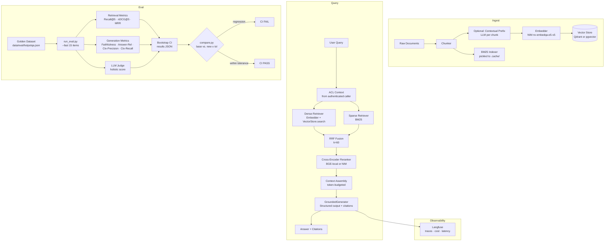

# Production RAG — Hybrid Retrieval · Reranking · Contextual Retrieval · Eval-Gated CI

A production-grade Retrieval-Augmented Generation system built behind clean,
swappable interfaces (no framework lock-in in the core). It pairs a real
retrieval pipeline with the thing most demos skip: a rigorous **eval harness**
that produces numbers, bootstrap confidence intervals, and a **CI gate** that
blocks quality regressions.

## Overview

Most RAG demos glue an LLM to a vector database and stop there. This system
adds the engineering discipline required before production:

- Hybrid retrieval (dense + BM25 + RRF) with cross-encoder reranking.
- Contextual chunking: an LLM-generated prefix per chunk improves recall
  (following Anthropic's contextual-retrieval technique).
- Server-side ACL isolation: every chunk carries a `tenant_id`; the filter
  is applied **before** similarity and is derived from the authenticated
  caller, never from the prompt text.
- Grounded, cited generation: structured output enforces inline citations;
  the generator refuses when context is insufficient.
- Guardrails: prompt-injection heuristics on input; PII redaction at ingest.
- RAGAS-style metrics implemented natively — no `ragas` library, no
  framework lock-in, fully injectable for offline testing.
- Bootstrap-CI paired comparison gate wired into GitHub Actions.

---

## Architecture

### Mermaid diagram (renders on GitHub)



### ASCII diagram (quick reference)

```
ingest → chunk (+contextual prefix) → embed → vector store (+BM25)
                                                 │
query → hybrid retrieve (dense + BM25) → RRF fuse → rerank (cross-encoder)
      → ACL filter (pre-similarity, server-side) → context assembly (budgeted)
      → generate (grounded, cited, structured output) → response
                                                 │
         traces + cost + latency metrics → Langfuse dashboard
                                                 │
eval: golden dataset → run_eval → bootstrap CI → compare gate → CI pass/fail
```

---

## Repo Layout

```
.
├── core/                 # Contracts, types, config, registry, pipeline
│   ├── interfaces.py     # Protocol definitions (Embedder, VectorStore, …)
│   ├── types.py          # Shared data models (Chunk, Answer, ACLContext, …)
│   ├── config.py         # All env knobs via pydantic-settings (Settings)
│   ├── registry.py       # Single place that names concrete implementations
│   ├── pipeline.py       # RAGPipeline: baseline (dense) and full (hybrid+rerank)
│   ├── rrf.py            # Reciprocal Rank Fusion
│   └── context_assembly.py
│
├── providers/            # Swappable implementations
│   ├── embedders/        # OpenAI-compatible (NIM / real OpenAI)
│   ├── generators/       # openai_compatible.py, anthropic.py
│   ├── rerankers/        # local (BGE cross-encoder), NIM
│   ├── sparse/           # BM25 (rank-bm25)
│   └── vectorstores/     # qdrant_store.py, pgvector_store.py
│
├── ingest/               # Ingestion pipeline
│   ├── run.py            # CLI: python -m ingest.run --dataset X [--limit N]
│   ├── chunking.py       # Fixed-size + overlap chunker
│   ├── contextual.py     # LLM-generated contextual prefix (cached)
│   └── pii.py            # PII redaction at ingest time (email/phone/SSN/CC)
│
├── corpora/              # Dataset adapters (one sub-package per corpus)
│   ├── hotpotqa/adapter.py
│   ├── arxiv/adapter.py
│   └── financebench/adapter.py
│
├── retrieval/
│   └── hybrid.py         # DenseRetriever, HybridRetriever
│
├── generation/
│   ├── grounded_generator.py   # Token-budgeted context assembly + citation enforcement
│   └── prompts.py
│
├── guardrails/
│   └── input_injection.py      # Heuristic + optional LLM injection/jailbreak detection
│
├── eval/                 # Evaluation harness
│   ├── run_eval.py       # CLI: python -m eval.run_eval --dataset X --version V [--fast]
│   ├── compare.py        # CLI: python -m eval.compare --dataset X --new V --baseline-file …
│   ├── generation_metrics.py  # Native RAGAS-style: faithfulness, answer_relevancy, …
│   ├── retrieval_metrics.py   # recall_at_k, ndcg_at_k, mrr, precision_at_k
│   ├── llm_judge.py      # Holistic LLM judge
│   ├── stats.py          # bootstrap_ci, paired_bootstrap
│   ├── fast_subset.py    # 15-item subset for CI --fast runs
│   └── baselines/        # Committed baseline JSONs (gate depends on these)
│
├── observability/
│   ├── langfuse_tracing.py
│   └── cost.py
│
├── app/
│   ├── demo.py           # Streamlit demo (make demo)
│   └── api.py            # FastAPI service (make api)
│
├── tests/                # Offline test suite (fakes, no secrets, no services)
├── infra/
│   ├── docker-compose.yml  # Qdrant + Postgres/pgvector + Langfuse
│   └── .env.example
├── data/eval/            # Generated golden sets (written by ingest.run)
├── .github/workflows/
│   └── eval-gate.yml     # CI: lint + offline tests + eval gate
├── Makefile
└── pyproject.toml
```

---

## Stack

| Concern | Default | Swappable to | Switch |
|---|---|---|---|
| Generation | NVIDIA NIM · `meta/llama-3.3-70b-instruct` | Anthropic Claude (Sonnet) | `GEN_PROVIDER=anthropic` |
| Embeddings | NIM · `nv-embedqa-e5-v5` (1024-d) | OpenAI · `text-embedding-3-large` (3072-d) | `EMBED_BASE_URL` + `EMBED_MODEL` + `EMBED_DIMENSION` |
| Vector store | Qdrant | pgvector | `VECTOR_STORE=pgvector` |
| Reranker | BGE cross-encoder (local, `bge-reranker-v2-m3`) | NIM rerank (`nv-rerankqa-1b-v2`) | `RERANKER=nim` |
| Observability | Langfuse (self-host) | — | `LANGFUSE_ENABLED=true` |

All switches are env vars read by `core/config.py` (pydantic-settings).
`core/registry.py` is the only place concrete class names appear.
No code changes are needed to flip providers.

---

## Datasets

Three corpora are supported, each with a corpus adapter in `corpora/` and a
golden eval set written by `ingest.run` to `data/eval/<dataset>.json`:

| Dataset | Domain | Why | Tenant split |
|---|---|---|---|
| HotpotQA | Multi-hop QA | Gold supporting sentences → retrieval metrics out of the box | ~5 % tenant-A-only, ~5 % tenant-B-only |
| arXiv | Scientific papers | Long documents, synthesized golden answers | Same split |
| FinanceBench | Financial filings | Precise factual QA, citation sensitivity | Same split |

The tenant split exercises the ACL isolation guarantee: tenant-A queries must
never surface tenant-B chunks.

---

## Quickstart

```bash
# 1. Install (shared uv venv)
make install                        # uv sync --all-extras

# 2. Configure
cp infra/.env.example .env
# Edit .env — at minimum set NVIDIA_API_KEY=nvapi-...

# 3. Start backends
make up                             # Qdrant + Postgres + Langfuse

# 4. Ingest a corpus
make ingest DATASET=hotpotqa
# or with a size limit:
uv run python -m ingest.run --dataset hotpotqa --limit 200

# 5. Evaluate
make eval DATASET=hotpotqa VERSION=baseline
make eval DATASET=hotpotqa VERSION=full

# 6. Compare (exits nonzero on regression)
make compare DATASET=hotpotqa BASE=baseline NEW=full

# 7. Demo / API
make demo                           # Streamlit on :8501
make api                            # FastAPI on :8000
```

> **Note on contextual prefixing:** pass `--contextual` to `ingest.run` to
> enable per-chunk LLM context prefixes.  This fires ~1 LLM call per chunk
> so respect NIM's ~40 rpm free-tier cap by using `--limit`.

---

## Metrics

> Values are **TBD** — fill in after running eval against the committed
> fixture. The harness reports k=5 (not k=10) because `rerank_top_n=8`
> by default; the table headers reflect the actual code.

| Phase | Recall@5 | nDCG@5 | Faithfulness | Answer-Rel | Ctx-Precision |
|---|---|---|---|---|---|
| Baseline (dense only) | — | — | — | — | — |
| Full (hybrid + rerank) | — | — | — | — | — |

Additional metrics computed by the harness: Precision@5, MRR, Context-Recall,
holistic judge score. All are reported with 95 % bootstrap confidence intervals.

---

## Guardrails & Security

**Server-side ACL pre-similarity filter**
Every chunk carries `tenant_id` and optional `acl_tags`. The vector store
and BM25 retriever apply ACL as a filter condition **before** scoring, not
as a post-hoc exclusion. The `ACLContext` on each request is derived from
the authenticated caller; it never originates from the prompt.

**Prompt-injection / jailbreak detection** (`guardrails/input_injection.py`)
`InjectionGuardrail` scans user input against 14 heuristic patterns
(ignore-previous-instructions, DAN mode, role-override, etc.). An optional
LLM second-opinion path is available for ambiguous inputs. Matching blocks
the request before it reaches the pipeline.

**Indirect injection (retrieved-content spotlighting)**
All retrieved chunk text is treated as **untrusted data**. The generation
prompt structure separates system instructions from retrieved passages
using numbered `[n]` markers. This makes prompt-injection payloads embedded
in documents less likely to be interpreted as instructions.

**PII redaction at ingest** (`ingest/pii.py`)
`PIIRedactor` strips emails, US phone numbers, SSNs, and credit-card numbers
from documents before chunking. Each redaction is logged to an audit trail.

**Citation enforcement** (`generation/grounded_generator.py`)
The generator is asked for structured output (`GeneratedAnswer`) that includes
the list of passage numbers used. Inline `[n]` markers in the answer text are
reconciled against the context window; any marker with no matching passage is
dropped. If context is insufficient the model sets `refused=True`.

---

## Eval Methodology

**Retrieval metrics** (`eval/retrieval_metrics.py`)
Recall@k, Precision@k, MRR, nDCG@k computed against gold `relevant_doc_ids`
exported by the corpus adapter. Default k=5.

**Generation metrics** (`eval/generation_metrics.py`)
Native implementations of the four RAGAS metrics — no external `ragas` library:
- **Faithfulness**: fraction of atomic answer claims supported by contexts (2 LLM calls).
- **Answer Relevancy**: mean cosine similarity between reverse-generated questions and original (1 LLM + N embed calls).
- **Context Precision**: AP-style weighted precision over context ranks (1 LLM call per context slot).
- **Context Recall**: fraction of ground-truth statements attributable to contexts (2 LLM calls).

**LLM judge** (`eval/llm_judge.py`)
Holistic quality score via a prompted generator, providing a single calibrated
signal across faithfulness, completeness, and coherence dimensions.

**Bootstrap confidence intervals** (`eval/stats.py`)
`bootstrap_ci` (1 000 resamples) reports 95 % CIs on all metrics.
`paired_bootstrap` is used by `compare.py` for the delta distribution.

**CI gate** (`.github/workflows/eval-gate.yml`)
`compare.py` exits nonzero if any metric in the new run falls below
`baseline − tolerance` (default 0.03). The gate reads from a committed
`eval/baselines/hotpotqa.json`; this file must be generated against the
same `--limit` used in CI (currently 50) and committed by the eval workstream.

---

## Observability

Langfuse tracing is opt-in (`LANGFUSE_ENABLED=true`). When enabled,
`observability/langfuse_tracing.py` emits a trace per query containing:

- Retrieval scores and chunk IDs for each stage (dense, BM25, fused, reranked).
- LLM token counts and estimated cost (`observability/cost.py`).
- End-to-end latency broken down by component.
- Eval metrics when run in online-eval mode.

The self-hosted Langfuse instance is started with `make up` (port 3000).

---

## What I'd Do at 100× Scale

| Area | Current | At 100× |
|---|---|---|
| Ingestion throughput | Sequential embed + upsert | Async batch pipeline (Celery / Ray), streaming embed |
| Embedding cache | Per-chunk contextual cache on disk | Distributed cache (Redis) keyed on content hash |
| Vector index | Single Qdrant collection | Sharded Qdrant cluster or managed Pinecone/Weaviate |
| BM25 | In-process rank-bm25 pickled | Elasticsearch / OpenSearch with BM25F |
| Reranker | Single cross-encoder | Batched GPU inference; NIM for throughput |
| ACL | Pre-filter in vector search | Combined dense filter + dedicated auth service |
| Rate limits | Sequential calls at 40 rpm | Request queue + exponential backoff + token-bucket |
| Eval | 15-item fast subset in CI | Nightly full-corpus eval on dedicated runner |
| Observability | Self-hosted Langfuse | Managed Langfuse cloud or OpenTelemetry → Grafana |
| Multi-tenancy | tenant_id field in chunks | Separate namespaces / collections per tenant |

---

## Make Targets

| Target | Description |
|---|---|
| `make install` | `uv sync --all-extras` — create venv and install everything |
| `make up` | Start Qdrant + Postgres + Langfuse via docker compose |
| `make down` | Stop all backend services |
| `make ingest DATASET=X` | Ingest corpus X (hotpotqa / arxiv / financebench) |
| `make eval DATASET=X VERSION=V` | Run eval (VERSION = baseline or full) |
| `make compare DATASET=X BASE=B NEW=N` | Compare two eval runs; exits nonzero on regression |
| `make demo` | Launch Streamlit demo on port 8501 |
| `make api` | Launch FastAPI service on port 8000 (uvicorn --reload) |
| `make test` | Run offline test suite (`pytest -q`) |
| `make lint` | Lint with ruff |
| `make fmt` | Format with ruff |
| `make clean` | Remove `.pytest_cache`, `.ruff_cache`, `eval/runs/` |

For `ingest` with a size limit or contextual prefixing, call the module
directly:

```bash
uv run python -m ingest.run --dataset hotpotqa --limit 200 --contextual
```
