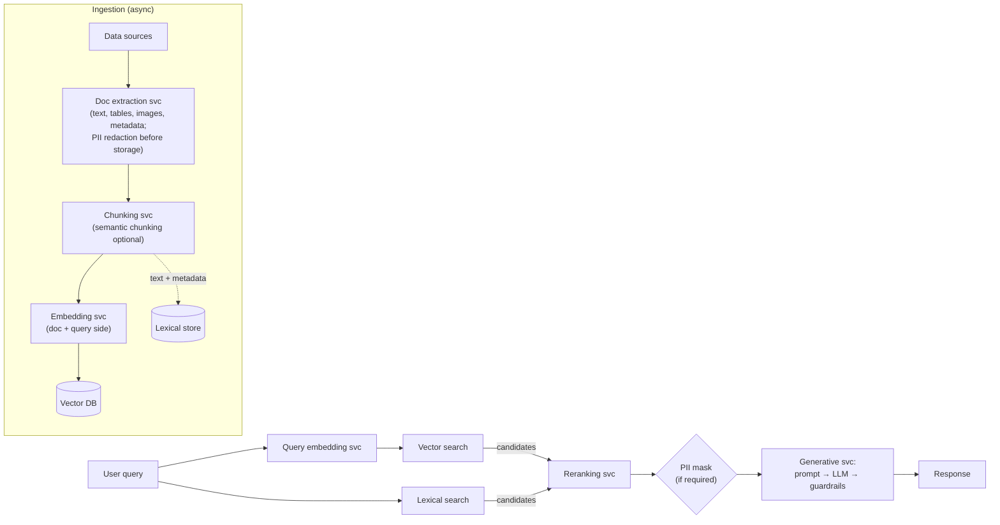

# Engineering Digest — Chapter 4: Deploying RAG to Production

> **Book:** *Hands-On RAG for Production* — Mendelevitch & Bao
> **Source:** `docs/book-review/ch4_deploy.txt` · book pages ≈ 105–133 (file also carries the opening of Ch. 5, p. 133)
> **Purpose:** engineer-focused summary of the chapter's production-readiness guidance: failure modes, latency/security/cost constraints, reference architecture, and the POC → production playbook.

---

## TL;DR

The chapter's thesis: **most of the "heavy lifting" from POC to production is standard, rigorous software/DevOps engineering** (high availability, load balancing, containerization, secrets management, CI/CD), layered with RAG-specific work. The authors frame six challenge areas, give a reference microservice architecture, and close with a phased transition + operations playbook. Their recurring recommendation is pragmatic: **buy turnkey for nondifferentiated components; keep in-house expertise only where it differentiates the business.**

Key numbers to remember (details in sections below):

- Retrieval latency budget: **≤ 300 ms average**; generative LLM **2–3 s** (smaller models) up to **5–10 s** (frontier)
- Production uptime target in worked example: **≥ 99.99%**
- DIY cost estimates are "notoriously unreliable": actual production spend often **3–5× projections**
- Semantic cache similarity threshold used in code example: **0.85 cosine**
- Budget alerts at **50% / 80% / 100%** of monthly spend; rate limiting guards against "denial-of-wallet"

---

## 1. Challenges with RAG in Production (pp. 106–125)

The chapter catalogs the failure dimensions: response quality, latency, security/privacy, vendor sprawl, team skills, and cost.

### 1.1 Response quality & hallucinations — four root causes

| # | Cause | Mechanism (chapter's examples) | Mitigation |
|---|-------|-------------------------------|------------|
| 1 | **No relevant data** | Corpus coverage gap: a Samsung TV manual missing from the index; an investment bank grounded only in SEC filings + internal research cannot answer about SambaNova (private ⇒ no filings). Retrieval still returns *irrelevant* chunks and the LLM answers anyway → confident wrongness. | Track user queries + response quality to find coverage gaps and grow the corpus. Re-ingestion needs a **staging verification workflow** (below). Partner with SMEs to judge what is source-of-truth vs. obsolete. |
| 2 | **Weak retrieval pipeline** | POC-grade plain vector search degrades as documents scale: more near-matches to filter/rank, bigger/more complex indexes needing efficient update+search algorithms. | Hybrid search + rerankers (Ch. 3); accept distributed-storage burdens: consistency, fault tolerance. Chapter's blunt rule: RAG is *garbage-in-garbage-out* — underinvested retrieval silently poisons generation quality. |
| 3 | **LLM hallucinations** | Even with perfect retrieval, models fail to faithfully use evidence. Partial/incomplete retrieved facts invite gap-filling with inferred content; outputs sit on a "spectrum of factuality" rather than true/false. | Choose LLMs with low hallucination rates; add detection/correction stages (Ch. 3) — acknowledged as significant extra R&D beyond POC scope. |
| 4 | **Prompt engineering** | Naive prompt (`{context} / Question / Helpful Answer`) leaves quality on the table and offers no refusal path or injection defense. | Add explicit instructions, e.g. *"If you don't know the answer, just say that you don't know; don't try to make up an answer."* Test across many queries; prompts double as prompt-injection defense. |

**Staging verification workflow** (worth stealing verbatim): re-running ingestion scripts against a live index is fine for a POC but risky in prod — one bug (broken character encoding, malformed metadata) pollutes the index for everyone. Pattern:

1. Ingest new data into a **staging collection** (subset or full clone of prod).
2. Run an **automated suite of retrieval unit tests**: are new docs retrievable and correctly formatted?
3. Only on green, **promote** the data into the live production index.

### 1.2 High latency — budgets and mitigations

**Budgets (p. 109):**

| Component | Target |
|-----------|--------|
| Retrieval stack (semantic + hybrid search, reranking) | ≤ **300 ms** average |
| Generative LLM | **2–3 s** (smaller models) → **5–10 s** (frontier); reasoning models higher |
| End-to-end | "a few seconds," comparable to ChatGPT expectations |
| Distribution | Control **tail latencies (e.g. P95)**, not just the mean — complex/resource-heavy queries wreck UX otherwise |

Scale multiplies latency everywhere: vector DB must stay properly indexed; hybrid search must absorb more data; rerankers see more candidates; you may need *more* chunks per prompt to hold accuracy. Also expect component swaps: a POC vector DB that kept everything in memory may not perform at production scale.

**Mitigation playbook:**

1. **Parallelization + auto-scaling via decoupled microservices.** A stateless, CPU-bound **orchestrator** service is the central brain: it calls an embedding service, then **fans out** to the vector DB and lexical search service *simultaneously*, gathers candidates, ships them to a dedicated reranker service, then to the LLM generation service. Fan-out/gather means retrieval latency ≈ the slowest source, not the sum of all sources. Each service scales independently on its own bottleneck signal (CPU utilization / in-flight GPU requests / DB connections).
2. **Alternative LLMs.** Swapping the POC's frontier model for smaller/faster ones cuts latency but risks quality — re-run RAG evaluation (Ch. 6) before/after.
3. **Software/hardware acceleration.** A100/H100-class GPUs for embedding/reranker/LLM pods, served through optimized inference servers: **vLLM, TensorRT-LLM, or TGI**. The authors call this layer *non-negotiable*: continuous batching handles concurrent generation requests; paged attention slashes memory overhead for RAG's long contexts.
4. **Efficient data indexing.** ANN indexes (**HNSW**, **IVFPQ**) for local vector DBs; sharded Elasticsearch/OpenSearch with appropriate analyzers so keyword lookups stay millisecond-fast (making fan-out viable).
5. **Caching.** High-speed in-memory KV stores (Redis, Dragonfly) in front of microservices:

| Cache layer | Key | On hit, bypasses |
|-------------|-----|------------------|
| Full response | hash of raw user query | the entire RAG pipeline |
| Retrieval | hash of query embedding | both search legs |
| Chunk | chunk IDs | the slow document store (S3/Postgres) |

   For NL queries, exact-hash caches miss ("How do I reset my password?" ≠ "I need to change my password"), so use **semantic caching**: embed the incoming query, similarity-search cached query vectors, return the stored result above a threshold (0.85 in their code). At production scale this introduces three hard problems:
   - **Invalidation:** TTL-only is fragile; prefer event-driven purge — ingestion publishes document add/update events (Redis Pub/Sub, Kafka), a subscriber clears affected entries.
   - **Eviction:** configure e.g. **LRU** before the cache eats all RAM.
   - **Horizontal scaling:** cluster/shard by key hash across machines; the chapter name-checks Redis LangCache.

Continuous monitoring is the catch-all: find real-time bottlenecks and systemic regressions.

### 1.3 Data security & privacy — defense-in-depth across three surfaces

**a) Ingestion layer.**
- Standard encryption through the whole ETL flow, and uniformly across every downstream stage: extraction, table/image processing, chunking, embedding, vector/lexical/graph storage.
- **PII/PHI redaction** must not destroy answerability:
  - *Masking* (`Ofer Mendelevitch` → `XXXX`) and *nulling* lose the contextual relationships around the value — "XXXX prescribed YYYY to ZZZZ" can't support prescription questions.
  - Preferred: **entity-aware redaction / typed masking** — replace with categories: `[DOCTOR_NAME] prescribed [MEDICATION] to [PATIENT_NAME]`. Security *and* semantics survive.
- For ISO/IEC 27001-style provenance: **hash-based tracking** — a digital fingerprint at each pipeline step gives auditors a verifiable chain of evidence.

**b) Vector / lexical / graph data stores.**
- Encryption at rest **and** in transit; **RBACs** on all stores.
- GDPR "minimum necessary": store only what the app needs, review/purge regularly, privacy-by-design.
- Plus standard enterprise hygiene: network security, continuous monitoring, incident response.

**c) Preventing data leaks + generation guardrails.**
- Stores hold documents with heterogeneous permission levels (all-staff vs. HR/exec-only). Wire a **permission-based filter into the query flow**: only chunks authorized for *the querying user* reach the LLM. This demands a consistent role taxonomy applied at ingestion time for *all* ingested data; back it with audits, filter testing, and monitoring of external interactions.
- **Third-party LLM leakage:** calling hosted OpenAI/Anthropic/Google models ships internal data over the network; vendors may log or temporarily cache inputs, and even anonymized payloads can leak signal via patterns/metadata. Consequence for highly sensitive deployments: run **open-source LLMs in your own DC/VPC** (examples given: OpenAI's gpt-oss, Meta Llama 4, Qwen, DeepSeek).
- **Guardrails** (introduced Ch. 1, detailed Ch. 3 §"Implementing Guardrails", p. 83): blocking disallowed content (hate speech, bias, etc.) is a *strict requirement* in production, needing logging/monitoring for violation tracking and incident response. Cheap win: let end users flag bad outputs (thumbs-down) to catch issues early.

### 1.4 Vendor chaos & integration woes (p. 119)

Beyond vector DB + embeddings + LLM, real stacks accrete: content extraction APIs (PDF/Word/PPT), table/image parsing, hybrid search & reranking, hallucination detection/correction models, security/compliance components, and possibly a graph DB for GraphRAG. DIY integration of all of this yields a **fragmented, brittle architecture** where *you* own every connection's uptime, latency, monitoring, and security.

**Table 4-1 vendor complexity checklist** (condensed):

| Area | Ask the vendor |
|------|----------------|
| API & integration | REST/gRPC/SDKs? Rate limits? Batch support? Auth methods (API key vs OAuth 2.0)? |
| Data & formats | Accepted input formats? Does output feed the next component directly or need a transformation layer? |
| Security & compliance | Encryption in transit/at rest? PII handling? SOC 2 / HIPAA / GDPR posture? Vulnerability-detection process? |
| Performance & scale | Guaranteed **P95/P99**? Auto/horizontal scaling? SLA uptime + failure penalties? |
| Monitoring & logging | Dashboard? Integrates with your observability stack? |
| Support & maintenance | Support channels? Guaranteed response time for critical issues? How are updates/versioning handled? |

Hidden trap: **support fragmentation**. When quality drops or latency spikes across a multi-vendor stack, you become the coordinator between each vendor's staff and SLA. A turnkey platform buys *a single point of accountability*.

### 1.5 Team & expertise (p. 120)

RAG sits at ML ∩ software engineering ∩ domain knowledge; four skill buckets must be bridged:

- **ML engineering** — embedding/reranker usage, GPU-vs-cost LLM inference choices, prompt engineering, hybrid search, retrieval optimization, hallucination detection/correction (+ graph query languages if KGs enter).
- **Data engineering** — scalable HA ETL over messy sources: PDFs, databases, websites, docs portals, SharePoint, Jira.
- **DevOps/MLOps** — containers, CI/CD, orchestration, GPU optimization, auto-scaling, ML workflow monitoring.
- **Security/compliance** — prompt-injection prevention, PII redaction, governance, privacy, audit trails for generated content.

Scale expectation-setting: some large financial institutions have identified ~**400** gen-AI use cases; most mature enterprises will find **≥ 30** valuable ones in the first two years — so the team problem compounds. Field moves too fast to stand still; bottom line is continuous, aggressive investment in hiring/upskilling **or** buying turnkey for nondifferentiated parts.

### 1.6 Total cost of ownership (p. 122)

- **Direct:** vendor management overhead (each vendor = security/legal/IT overhead + lock-in/pricing-hike risk); retrieval pipeline operation (vector DB + lexical DB + reranking) — note vector DBs show **nonlinear cost scaling** as data/latency/uptime demands grow; compute & storage for staging *and* prod, CPU *and* GPU.
- **Indirect/ongoing:** growth-driven compute/storage creep, support contracts, upgrades, infrastructure monitoring, enterprise integrations, extra ingestion/testing/DevOps/security systems.
- **Additional:** cybersecurity controls (intrusion detection, audits), business continuity → **HA multi-region with automatic failover** costs more.
- Frame everything as **CAPEX vs OPEX**. Reality check: DIY initial estimates are notoriously unreliable — actual production expenses often run **3–5× projections**.

**Cost controls:**
- Integrate cloud/LLM billing dashboards into your primary monitoring; **budget-based alerting** at 50%/80%/100% of monthly budget.
- **Rate limiting** so one faulty service, malicious user, or "denial-of-wallet" attack can't produce a catastrophic bill.
- **Cascading model router** (Fig. 4-1): send each query first to a small cheap model; return immediately on high-confidence/"simple" classification, else escalate to the frontier model. Dramatically cuts average cost/query while preserving quality on hard questions. Build it yourself or use LiteLLM / Not Diamond — either way, wire it into observability with automatic per-call cost computation.
- TCO unpredictability is itself a top reason companies pick turnkey RAG (single vendor ⇒ predictable cost structure).

### 1.7 RAG evaluation as the safety net

"You can't fix what you can't measure." Without a reliable framework for response quality and hallucination quantification, quality silently degrades as you scale. Production needs scalable implementations of retrieval metrics, generation metrics, and end-to-end evaluation — full treatment deferred to Chapter 6 (metrics like context precision/recall, answer relevance, UMBRELA appear in Table 4-2).

---

## 2. Reference Production Architecture (pp. 125–127, Fig. 4-2)

A robust pipeline is **decoupled and microservice-based** — the same design that solves latency also tames complexity and enables independent scaling.



**Ingestion-side services:**
- **Document extraction** — text from binaries, table/image processing, metadata extraction; PII redaction typically happens *before* metadata is stored.
- **Chunking** — separate service (vs. folded into extraction) for flexibility with complex strategies like semantic chunking.
- **Embedding** — document and query embedding may share one model-hosting service or be split.

Storage split: embedding vectors → vector DB; text itself (+ commonly metadata) → lexical search system. Every service: multiple instances for HA, end-to-end encryption.

**Query flow:** embed the query → semantic search on the vector DB **and** lexical search in parallel → combine candidate chunks → rerank → optional PII masking pre-prompt → LLM + guardrails inside a generative microservice → response.

**Cross-cutting (partly "not shown in the diagram" per the authors):**
- Caching at retrieval / chunk / full-response levels.
- Security at every layer & component — at rest and in transit — plus vulnerability detection/mitigation everywhere.
- The MLOps triad of **logging, monitoring, observability** integrated into each component per org best practices.

---

## 3. Code Patterns Shown in the Chapter

### 3.1 `SemanticCachedRetriever` (LangChain, pp. 112–114)

A `BaseRetriever` subclass demonstrating semantic caching; full code is on the book's GitHub. Core mechanics:

```python
class SemanticCachedRetriever(BaseRetriever):
    # in-memory lists: _cache_embeddings, _cache_results, _cache_queries
    def _get_relevant_documents(self, query: str) -> List[Document]:
        query_embedding = np.array(self._embeddings.embed_query(query))
        cache_hit = self._find_similar_cached(query_embedding)   # cosine sim vs cached query vectors
        if cache_hit:                                            # threshold default 0.85
            docs, original_query, similarity = cache_hit
            return docs                                          # skip retrieval entirely
        results = self._base_retriever.invoke(query)             # miss → real retrieval
        self._store(query_embedding, query, results)
        return results
```

Engineering read: the example is deliberately naive — an unbounded in-memory list scanned linearly per query. Production needs the three upgrades the authors call out immediately after: event-driven invalidation, LRU eviction, and Redis clustering/sharding (Redis LangCache exists for exactly this).

### 3.2 Entity-aware PII redaction with Microsoft Presidio (pp. 116–117)

Typed masking in ~15 lines:

```python
from presidio_analyzer import AnalyzerEngine
from presidio_anonymizer import AnonymizerEngine
from presidio_anonymizer.entities import OperatorConfig

def entity_aware_redaction(text):
    analyzer, anonymizer = AnalyzerEngine(), AnonymizerEngine()
    results = analyzer.analyze(text=text, entities=["PERSON", "PHONE_NUMBER"], language='en')
    anonymized = anonymizer.anonymize(text=text, analyzer_results=results, operators={
        "PERSON":       OperatorConfig("replace", {"new_value": "<PERSON>"}),
        "PHONE_NUMBER": OperatorConfig("replace", {"new_value": "<PHONE_NUMBER>"}),
    })
    return anonymized.text

# "Dr. Bao called 123-555-1122." → "Dr. <PERSON> called <PHONE_NUMBER>."
```

Note the output keeps sentence structure (`Dr.` survives), which is what preserves semantic relationships for retrieval/answering.

---

## 4. POC → Production Playbook (pp. 128–130)

### Step 1 — Write the POC retrospective report

Answer, at minimum: which components (vector DB, embedding model, reranker, LLM)? How was data collected/ingested — special table/image handling, troublesome sources? Which prompt, and how did it perform on quality/hallucinations? Which advanced capabilities were tested (hybrid search, KGs)? Did quality meet expectations — *how was latency measured and quality evaluated*? What unexpected issues surfaced? What functionality was missing and why did you want it?

### Step 2 — Define numeric goals & requirements

Revisit business goals for alignment with POC objectives; express requirements as **KPIs**. Table 4-2's worked example (sample values from the book):

| KPI / requirement | Definition | POC | Production target |
|---|---|---|---|
| Query latency | mean/median over 50 sample queries | 7.5 s / 8.5 s | 4.5 s / 4 s |
| Uptime | % time operational | not measured | ≥ 99.99% |
| Response quality | context precision/recall, hallucination rate, answer relevance, UMBRELA (Ch. 6) | not measured | CP ≥ 0.9 · CR ≥ 0.8 · hall ≤ 5% · AR ≥ 0.9 · UMBRELA > 2.5 |
| Data ingestion | sources, file types, refresh cadence | local PDFs only | PDF/DOCX/PPTX/HTML from web, S3, Snowflake, Notion; daily refresh |
| Retrieval pipeline | techniques supported | vector search only | + hybrid search, relevance & diversity reranking |
| Chunking | strategies | fixed | fixed + semantic |
| LLM selection | models supported | GPT-4o | GPT-5.1, Claude 4.5, Llama 3.3 70B, DeepSeek-R1 |
| Embedding selection | models supported | anything on HF | HF + OpenAI/Cohere |
| Knowledge graph | included? | no | no |

**Also plan** (beyond the table): hardware (CPU/GPU mix, memory, networking, HA + staging environments); development process (code hosting, CI/CD system, unit/integration/regression testing); data connectivity (enterprise systems to connect, credential handling, RBAC to prevent leaks); security/governance (audit trails, SOC-2/HIPAA/GDPR as applicable, end-to-end encryption); monitoring (uptime, latency, user satisfaction); budget (expected monthly spend, and how performance degrades on overrun).

Execution itself is "traditional execution excellence" — project management, Agile, team coordination; org-specific R&D/IT practices are declared out of scope.

---

## 5. Ensuring Continued RAG Success (pp. 130–132)

- **Launch:** train employees/customers on capabilities, when to use it, how to use it well.
- **Watch for the adoption cliff:** query volume often peaks in week one, then decays by weeks 2–3. That decay is a symptom — useless responses (users revert to old workflows) or latency users won't tolerate. Good logging/monitoring localizes it.
- **Per-query diagnostics:** log each response with a thumbs-up/down affordance; flagged queries let you triage whether failure is retrieval, generation, hallucination, or missing data.
- **Expect surprises:** issues not caught in pre-launch testing commonly surface in the first two weeks; the differentiator is reacting fast on metrics.
- **Ongoing ops:** maintenance, compute upgrades as volume grows, uptime firefighting, security-driven component upgrades (e.g., a vector DB CVE).
- **Upgrading techniques is a project, not a config change.** Example: a new embedding model promising +5% quality must be adopted at *both* ingest and query time (i.e., re-embed the corpus), tested end-to-end, dependencies updated, and old-vs-new RAG evaluation run to prove the gain — while checking latency regressions or new GPU requirements.
- **Every stack upgrade follows the deployment loop: plan → test → deploy → monitor.**

## 6. Conclusion & Takeaways

- Enterprise RAG = requirements (security, governance, privacy, systems operations) **+** a durable multidisciplinary team + ongoing maintenance budget.
- Maintain **"data hygiene" at the source**: documents fed to RAG must be clean, deduplicated, regularly updated — an organizational process, not a script.
- The gen-AI landscape (better LLMs/embeddings/hardware) evolves faster than teams can absorb; keeping current takes real investment.
- Plan beyond v1 for the wave of follow-on use cases.
- Turnkey platforms are framed as the rising alternative: vendor owns quality/upgrades/security/monitoring; you own data choice + business-workflow integration (Ch. 5 covers platforms, demoed via Vectara).

**Reviewer's engineering notes / caveats:**

1. **Vendor bias flag:** the chapter repeatedly argues for turnkey platforms, Table 4-2 draws on "Vectara customers," and Ch. 5 demos Vectara. Sound advice, but read the DIY-vs-buy framing with that affiliation in mind.
2. Strategy-level chapter: no infra code beyond the two snippets; HNSW/reranking/guardrails internals are delegated to Chapters 2/3/6/9. Treat this as a *checklist source*, not an implementation guide.
3. Source-text quirks (extraction artifacts, not book errors): running page-number footers interleaved with body text; a stray `}you e` token inside the Presidio snippet; Figures 4-1/4-2 are referenced but absent from the txt.
4. The file's tail (~p. 133) contains the opening of Chapter 5 ("The RAG Platform": RAG-as-a-service definition, DIY vs platform trade-off, e.g., Pinecone/Weaviate/Zilliz/Qdrant, Cohere Embed v4/Qwen3 embeddings). Out of scope here.

*Digest coverage: all 1114 lines of `ch4_deploy.txt` (book pages ~105–133).*
